# Artifice Toolkit
Normally, extending Unity’s editor requires specialized knowledge of IMGUI or the UI Toolkit libraries, along with maintaining separate files for each editor extension. This makes the editor's capabilities less accessible and often a hassle to research, learn and develop.

The ArtificeToolkit simplifies this process by providing custom attributes that can be applied directly in the source code, automatically altering the appearance of properties in the editor. The toolkit can be used in a variety of creative ways and can even be extended by creating new attributes.

To demonstrate its usage and effectiveness, see the following MonoBehaviour script's inspector. On the left is the default inspector generated by Unity, and on the right is the same script with a few additional attributes.

<p align="center">
  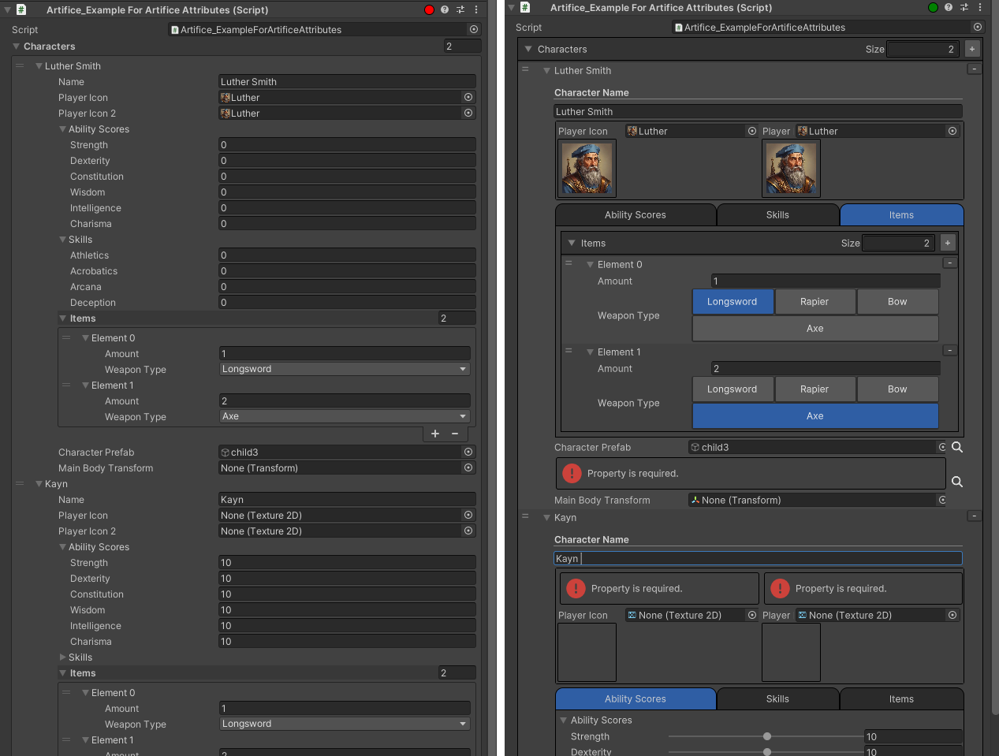
</p>

## Why use the ArtificeToolkit?

- Visually "lightweight" inspectors reduce cognitive load by removing unnecessary information.
- A simplified interface helps developers focus on relevant details, minimizing distractions.
- Streamlining the editor reduces mental effort, improving workflow efficiency and effectiveness.


## What is included in the ArtificeToolkit?
The Artifice Toolkit offers three powerful tools:

1. [Artifice Inspector](#artifice-inspector-and-custom-attributes): Alter the appearance of your editor's inspector with simple C# custom attributes. This is editor scripting without the editor scripting knowledge being required!

2. [Artifice Validator](#artifice-validator): Attach validator attributes to your serialized properties to always make sure certain rules are being followed. Do not waste time on absent minded mistakes ever again.

3. [Artifice Drawer](#artifice-drawer): The ArtificeDrawer is what renders everything in the ArtificeToolkit. Invoke the drawer in your Editor Scripts with a SerializedObject or SerializedProperty and you will receive the rendered result of it. This essentially makes the ArtificeDrawer a first-class citizen inspector.

## How to install into your Unity project?
You can add the ArtificeToolkit as any other Unity Package. Since this is an alpha testing phase, it can only be added as a local package through Windows -> Package Manager. Then press the "plus" icon and choose "Add Package from disk...". The select the package.json file and the ArtificeToolkit will be linked to your project.

<p align="center">
  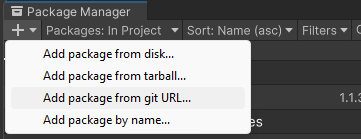
</p>
()

<!-- CUSTOM ATTRIBUTE CATEGORIES AND LINKS -->
# Artifice Inspector and Custom Attributes
By using custom attributes in your MonoBehaviour scripts you can quickly alter the inspector's appearance. In this section, you will find all the attributes which are tested and ready for use.

By default, the Artifice Drawer is disabled. You can always turn it on/off through the dedicated MenuItem "ArtificeToolkit"

<p align="center">
  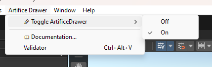
</p>


## Top 3 Recommended Attributes
Following are the simplest to use attributes which can have a big impact on visuals of the inspector.

- [FoldoutGroup](#foldout-group)
- [Required](#required)
- [PreviewScriptable](#previewscriptable)

## Group Attributes
Group Attributes can be used to bring together various properties in a form of a group. Such groups can also work in a nested manner as shown in the [BoxGroup](#boxgroup) example.

- [BoxGroup](#boxgroup)
- [FoldoutGroup](#foldout-group)
- [TabGroup](#tab-group)
- [HorizontalGroup](#horizontal-group)
- [VerticalGroup](#vertical-group)

Note: BoxGroup and FoldoutGroup can be further enhanced using the GroupColor enum.

## Validation Attributes
Validation Attributes are used to assert certain rules over your properties. This is achieved in the inspector visualy using an error prompt, and through the use of the [ArtificeValidator](#artifice-validator).

- [Required](#required)
- [AssetOnly](#assetonly)
- [SceneObjectOnly](#sceneobjectonly)
- [ChildGameObjectOnly](#childgameobjectonly)
- [MinValue](#minvalue)
- [MaxValue](#maxvalue)

## Essential and Easy Attributes
These attributes can and should be used frequently. They will at a bare minimum simplify and make the inspector more readable. 

- [Title](#title)
- [EnumToggle](#enumtoggle)
- [EnableIf](#enableif)
- [PreviewScriptable](#previewscriptable)
- [PreviewSprite](#previewsprite)

## Miscellaneous
- [Space](#space)
- [Range](#range)
- [HideLabel](#hidelabel)
- [InfoBox](#infobox)
- [ConditionalInfoBox](#conditionalinfobox)
- [MeasureUnit](#measureunit)

<!-- ALL ATTRIBUTES DETAILED -->
## All Attributes

<!-- GROUP ATTRIBUTES -->
### BoxGroup
The simplest form of a Group attribute is the BoxGroup. Every serialized property of the script will be rendered inside of a container with the given title.

```c#
[SerializeField, BoxGroup("GroupA")]
private int first;

[SerializeField, BoxGroup("GroupA")]
private int second;

[SerializeField, BoxGroup("GroupA/GroupB")]
private int third;
```  
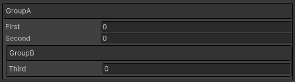


### Foldout Group
The FoldoutGroup extends the BoxGroup by allowing the user to optionally collapse the container.

```c#
[SerializeField, BoxGroup("GroupExample/GroupA")]
private int first;

[SerializeField, BoxGroup("GroupExample/GroupA")]
private int second;

[SerializeField, FoldoutGroup("GroupExample/GroupB")]
private int third;

[SerializeField, FoldoutGroup("GroupExample/GroupB")]
private int fourth;
```
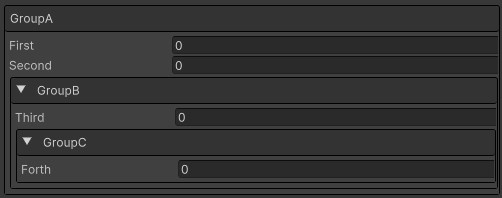

### Tab Group
The TabGroup allows you to create tabs inside of the Unity inspector. The syntax is more complex than Box and Foldout groups but it is well worth it. The first string dictates the name of the group and the second one dictates the name of the tab. All the properties that belong in the same group and same tab, will be contained together.

```c#
[SerializeField, TabGroup("Example", "Integers")]
private int first;

[SerializeField, TabGroup("Example", "Integers")]
private int second;

[SerializeField, TabGroup("Example", "Strings")]
private string third;

[SerializeField, TabGroup("Example", "Strings")]
private string fourth;

[SerializeField, TabGroup("Example", "Strings")]
private string fifth;
```
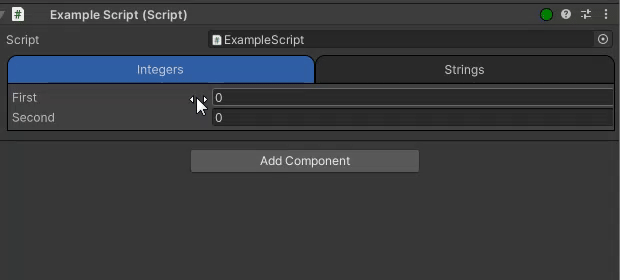

### Horizontal Group
The HorizontalGroup attribute allows you to align multiple properties into a single line, instead of having every property be rendered in a new line. Note, that the Horizontal and Vertical groups do not show their titles and are solely used for structuring.

```c#
[SerializeField, HorizontalGroup("horizontal1")]
private List<int> leftColumn;

[SerializeField, HorizontalGroup("horizontal1")]
private List<int> rightColumn;
```
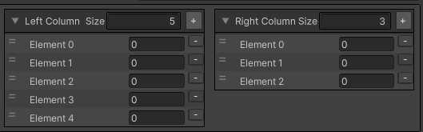

### Vertical Group
The Vertical Group is only useful inside of a horizontal group, to dictate a vertical column of properties inside of it.

```c#
[SerializeField, HorizontalGroup("horizontal1"), VerticalGroup("horizontal1/vertical")]
private List<int> leftColumn;

[SerializeField, HorizontalGroup("horizontal1"), VerticalGroup("horizontal1/vertical")]
private int leftColumnInteger;

[SerializeField, HorizontalGroup("horizontal1")]
private List<int> rightColumn;
```
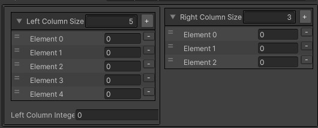

---

<!-- VALIDATION ATTRIBUTES -->
### Required
The Required field prompts the inspector with an error indicator if the property has not been set. This is GREATLY important in Unity, where it is common to initialize fields and dependencies through [SerializedField] properties. This is what makes the Required field the most important and most commonly used validation attribute.

```c#
[SerializeField, Required] 
private Transform requiredFieldExample;
```

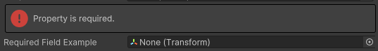

### AssetOnly
AssetOnly validates that the value of the serialized property is an asset. This is useful when you have a field for a prefab that will be potentially instantiated. It is common to drag a GameObject from the scene, instead of the assets.

```c#
[SerializeField, Required, AssetOnly] 
private Transform requiredAssetOnlyExample;
```

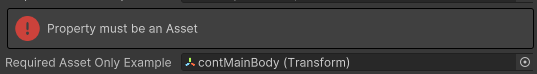

### SceneObjectOnly
Works exactly like the [AssetOnly](#assetonly) attribute but in-reverse. This validates that the serialized property value is of an instantiated gameobject in any loaded scene.

```c#
[SerializeField, Required, SceneObjectOnly] 
private Transform requiredSceneOnlyExample;
```

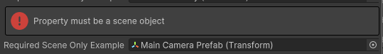

### ChildGameObjectOnly
In Unity, it is also common to have scripts which require references from the children of the GameObject. Use the ChildGameObjectOnly attribute to assert this behaviour. 

In addition, when this attribute is used, the inspector is further enhanced allowing for optimized search of the hierarchy, previewing only the valid GameObjects/Scripts based on the type of the serialized property..

```c#
[SerializeField, Required, ChildGameObjectOnly] 
private Transform requiredChildOnlyExample;
```

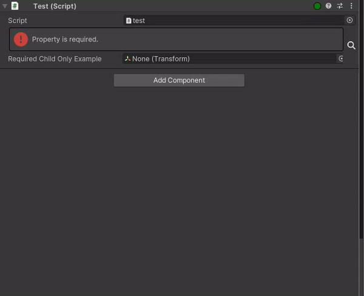

---

<!-- EASY AND ESSENTIALS -->
### Title
The Title attribute allows you to highlight a specific part or property of your inspector. It can also be used in combination with the [HideLabel](#hidelabel) to create a new visual representation of fields as shown below.

```c#
[SerializeField, Title("Name")]
private string name;

[SerializeField, Title("Age"), HideLabel, Range(0, 100)]
private int age;

[SerializeField, Title("City"), HideLabel]
private string city;
```

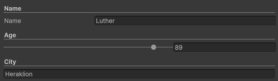


### EnumToggle
EnumToggle converts the conventional for of enum rendering to a multi-button preview. The [Flags] attribute is also supported. Note, that this is useful mostly in enums with a small number of different values.

```c#
public enum Directions
{
    Up, Down, Left, Right
}

[SerializeField, EnumToggle] 
private Directions direction;
```


### EnableIf
This attributes allows you to set an equality condition using another field in the same scope to dictate where the target property will be shown or not. This is a really usefull attribute to optionally show properties that depend upon a bool check or enum check. 

```c#
[SerializeField]
private bool shouldSpawnParticlesOnDestroy;

[SerializeField, FoldoutGroup("On Death", GroupColor.Red)]
private ParticleSystem prefabOnDeathParticles;

[SerializeField, FoldoutGroup("On Death", GroupColor.Red)]
private float onDeathDurationSeconds;

[SerializeField, EnableIf(nameof(shouldSpawnParticlesOnDestroy), true), FoldoutGroup("On Death", GroupColor.Red)]
private float onDeathSoundFxVolume;
```

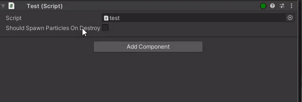

---

**NOTE**: The custom attributes of the Artifice, are processed from last to first. This allows us to perform various tricks since both the EnableIf and the FoldoutGroup, wrap the property in another VisualElement container. By having the EnableIf before the FoldoutGroup, on the LAST instance of the FoldoutGroup, the EnableIf captures the entire FoldoutGroup, although we have only declared it at a single serialized property.

---

### PreviewSprite
PreviewSprite works only on the Sprite and Texture2D serialized properties. It renders an enlarged image of the selected value.

```c#
[SerializeField, PreviewSprite] 
private Sprite characterPortrait;
```

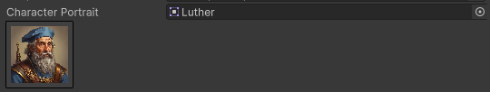

### PreviewScriptable
This is one of the most magical attributes in the Artifice Toolkit. It allows you to dynamically instantiate a scriptable object inspector inside of another inspector. This can even work in a nested manner, previewing scriptable objects inside of other scriptable objects etc.

```c#
[CreateAssetMenu(menuName = "ScriptableObject/Character")]
public class SCR_Character : ScriptableObject
{
    [PreviewSprite, HorizontalGroup("row"), HideLabel]
    public Texture2D icon;

    [Title("First Name"), HorizontalGroup("row"), VerticalGroup("col"), HideLabel]
    public string firstName;
        
    [Title("Last Name"), HorizontalGroup("row"), VerticalGroup("col"), HideLabel]
    public string lastName;
}

[SerializeField, PreviewScriptable]
private List<SCR_Character> mainCharacter;
```

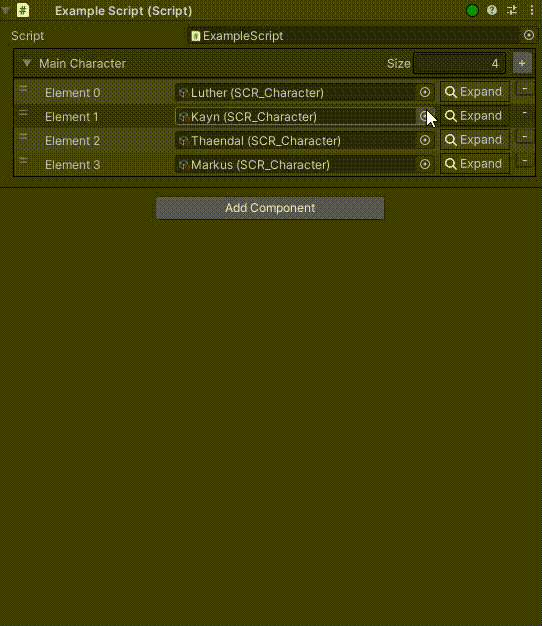

---

<!-- Miscellaneous -->
### Space
The Space attribute can receive up to four parameters reflecting the margin in pixels you want your element to have from top, bottom, left, right directions.

### Range
The Range attribute works on integers and floats and allows you to control them through a sliding bar. For this, a min and max value are required.

### HideLabel
The HideLabel attribute as the name suggests, finds and dynamically hides the label of the label.

### InfoBox
The InfoBox allows you to add informational or warning prompts to a property. This could be useful for example to document or explain some rules regarding a specific value.

### ConditionalInfoBox
The ConditionalInfoBox allows you to optionally show an InfoBox when some condition is met, in a similar fashion as [EnableIf](#enableif).

### MeasureUnit
MeasureUnit appends any string passed to it at the right of a property. This can be commonly used to indicate whether a time value is measured in seconds or milliseconds! It can even be used as a self documented part of the code it self.

### MinValue
MinValue asserts a minimum int or float value to the serialized property. 

Note: Currently this only works while the inspector is open. There is nothing stoping the value of going below the minimum value if the inspector is closed.

### MaxValue
As [MinValue](#minvalue) but for a maximum value.


<!-- ARTIFICE VALIDATOR -->
# Artifice Validator
The best way to solve bugs, is to avoid creating them. Assertions are one of the most powerful ways to do this and it is considered one of the best programming practices. Using the Artifice Validator, you can apply assertions in your serialized properties.

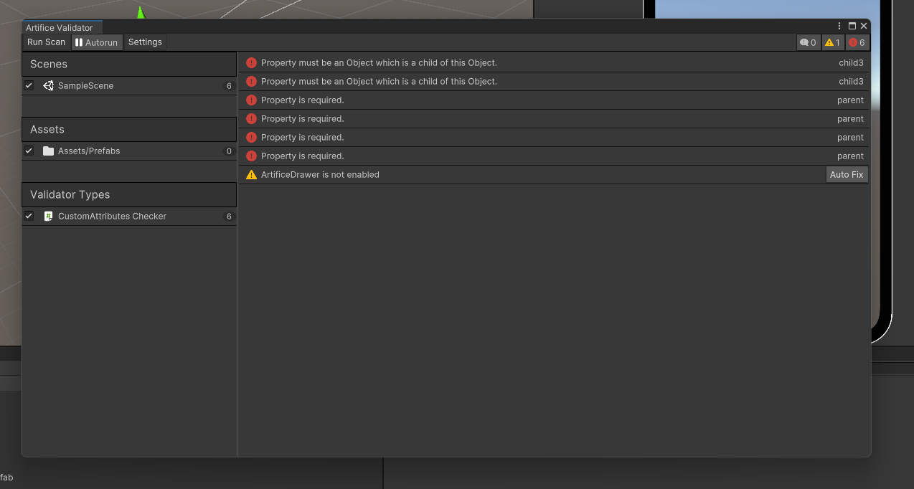

The Validator works with attributes which inherit from the ValidatorAttribute class. Such attributes have an additional implementation explaining what they are supposed to be asserting. The most common use case the [Required](#required) attribute, to make sure the property has been assigned with a reference.


<!-- ARTIFICE DRAWER -->
# Artifice Drawer
The ArtificeDrawer is what renders everything when the Artifice Inspector is enabled. The ArtificeDrawer can receive a SerializedObject or SerializedProperty and returns a VisualElement of the rendered result. It essentially parses the SerializedObject or SerializedProperty and renders either the default result or the enhanced result if CustomAttributes have been used on that property.

This section will only interest you if you want to learn the underlying secrets of how the ArtificeToolkit works at its core and learn how to extend it with your own CustomAttributes and tools. Knowledge regarding CustomEditors, CustomPropertyDrawers etc will be needed.

## ArtificeDrawer GUI Steps
When a property directly uses a CustomAttribute, the drawer will access the respective [CustomAttributeDrawer](#custom-attribute-drawer) and call its GUI steps in order

  1. Pre GUI: Appends a VisualElement before the property.
  2. On GUI: Replaces the property with the result of this method. Only applies with IsReplacingProperty is set on true.
  3. Post GUI: Appends a VisualElement after the property.
  4. Wrap GUI: Returns a new VisualElement which adds the VisualElements from the previous steps inside of it.
  5. On Bound Property GUI: Executes code when the OnGUI VisualElement is attached in the inspector.

## Creating new CustomAttributes
To create a new CustomAttribute, you need to create the following:
  1. YourCustomAttribute inheriting from CustomAttribute. This should be placed in a runtime folder.
  2. Artifice_CustomAttributeDrawer_YourAttribute inheriting from the Artifice_CustomAttributeDrawer placed inside an Editor folder. In a similar fashion as CustomPropertyDrawers, you need to mark this class with a [CustomAttributeDrawer(typeof(YourAttribute))] to link them together.

This section will be more documented in the future. For now, you can see examples of custom attributes like TitleAttribute and it's CustomAttributeDrawer_Title.